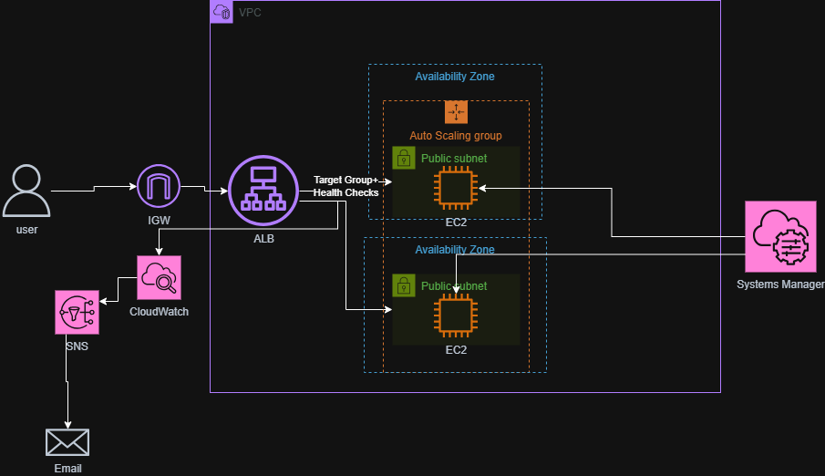

## Overview

The aim of this project was to create a highly available web application that spans two Availability Zones. An Application Load Balancer distributes incoming traffic across the EC2 instances, while health checks make sure that traffic is only sent to healthy instances.

If an instance or the Apache service fails its health checks, the Auto Scaling group terminates and replaces the affected instance. I also configured a CloudWatch alarm and SNS notifications so that an email is sent when an unhealthy target is detected. A CPU target tracking policy automatically increases or reduces the number of instances based on demand.

## Architecture

## Technologies
Terraform, AWS, EC2, Auto Scaling, Application Load Balancer, Target Groups, VPC, public subnets, Internet Gateway, IAM, Systems Manager, CloudWatch, SNS, Git and GitHub.

## What I built
I built a highly available AWS web application across two Availability Zones using Terraform. Each Availability Zone contains a public subnet that can run an EC2 instance managed by an Auto Scaling group.

An internet-facing Application Load Balancer receives HTTP requests and forwards them to healthy instances in its target group. The default round-robin routing algorithm distributes requests across the healthy targets.

The EC2 instances are created from a launch template and configured using a user data script. This script installs Apache and creates a simple webpage that displays the hostname of the instance responding to the request.

The Auto Scaling group maintains a minimum of two instances and can increase to a maximum of four. Target-tracking scaling monitors average CPU utilisation and adjusts the number of instances to keep CPU usage close to 50%.

I also configured Systems Manager so that I could manage the instances and run commands without exposing SSH. CloudWatch monitors unhealthy targets, while SNS sends an email notification when the unhealthy-target alarm is triggered.

## Security decisions
I created separate security groups for the ALB and EC2 instances. The ALB accepts HTTP traffic from the internet, while the EC2 instances only accept HTTP traffic from the ALB security group. This prevents users from bypassing the load balancer and directly accessing the web servers.

I used Systems Manager instead of opening port 22 for SSH. The instances receive the required permissions through an IAM role and instance profile, which avoids using long-lived or hard-coded AWS credentials.

The SNS email address is stored in a Terraform variable file that is excluded from Git, along with Terraform state files and the local .terraform directory.

## Failure and scaling tests
I tested an EC2 failure by terminating one of the instances managed by the Auto Scaling group. There was a brief 502 error during the transition, after which the ALB continued sending requests to the remaining healthy instance. The Auto Scaling group launched a replacement and returned the environment to two healthy targets.

I then tested an application-level failure by using Systems Manager to stop Apache on one instance. The EC2 instance remained running, but the ALB health check detected that the application was unavailable and marked the target as unhealthy. Because the Auto Scaling group was configured to use ELB health checks, it terminated the unhealthy instance and launched a replacement.

The CloudWatch alarm detected the unhealthy target and sent an email through SNS. Once the replacement passed its health checks, the target group returned to two healthy targets.

Finally, I generated CPU load on both instances using stress-ng. When average CPU utilisation exceeded the 50% target, the Auto Scaling group launched additional instances. Once the test ended and CPU usage dropped, the group automatically scaled back to its minimum of two instances.

## Problems encountered
One of the first problems I encountered was an Auto Scaling validation error stating that groupName could not be used with the subnet parameter. This happened because I used security_group_names in the launch template while providing a security group ID. I fixed this by using vpc_security_group_ids.

After the infrastructure deployed, the ALB returned a 502 Bad Gateway response and the targets failed their health checks. I discovered that I was using an Ubuntu AMI, but the user data script contained Amazon Linux commands such as yum and referenced the httpd service. I changed the script to use apt-get and apache2, after which the instances became healthy.

The instances also initially launched without public IPv4 addresses, which prevented them from downloading the packages required by the user data script. I enabled public IP assignment on both public subnets and replaced the existing instances.

Another issue was that the instances did not appear in Systems Manager. I created an EC2 IAM role, attached the AmazonSSMManagedInstanceCore policy, added it to an instance profile and referenced that profile from the launch template. I then refreshed the Auto Scaling group so the replacement instances used the updated template.
## Lessons learned
This project helped me understand how an Application Load Balancer, target group, health checks and Auto Scaling group work together. The ALB only sends requests to healthy targets, while the Auto Scaling group is responsible for maintaining the desired capacity and replacing failed instances.

I learned the importance of checking which operating system an AMI uses because package managers, package names and service names can be different. The 502 error also gave me more experience troubleshooting from the target group backwards instead of assuming the ALB itself was the problem.

I gained more experience with Terraform references, nested blocks, launch templates, instance profiles and security group rules. I also learned that changing a launch template does not automatically update existing instances, so an instance refresh or replacement is required.

Testing the project helped me understand the difference between an EC2 instance failure and an application failure. I also learned how CloudWatch, SNS and target-tracking policies can provide monitoring, notifications and automatic scaling.
## Future improvements
Move the EC2 instances into private subnets and keep only the ALB in public subnets.

Add HTTPS using an ACM certificate and redirect HTTP requests to HTTPS.

Store Terraform state remotely in a protected S3 backend with state locking.

Add ALB access logging for troubleshooting and investigation.

Create a CloudWatch dashboard for target health, request count, response time and CPU utilisation.

Add GitHub Actions to run Terraform formatting, validation and security checks.

Replace the AWS-managed SSM policy with more granular permissions where practical.

Add AWS WAF to provide additional protection for the public application.
